# 中国语言起源探究

敬畏自然，尊重不同文明的优秀文化，抛砖引玉，揭示不同文明语言文化的起源。

## 如何探究中国语言的起源？

### 为什么需要语言？

人类早期没有意识到需要创造某种语言，由于人类的生存实践活动需要协作，促使人与人之间需要信息交互。信息交互成了一种必要手段来满足协作性活动。随着时间的推移，信息交互的方式发展得越来越高级，越来越高效，越来越广泛，越来越体系化，最终形成了以口语为主导的交互方式，这种交互方式标志着真正意义上语言的诞生。

简单来说，**语言是辅助人类进行协作性活动的一种信息交互工具**。

当然，语言在人类不同的文明阶段，其功能性也得到了延伸。不局限于仅仅是一种信息交互工具，也可以是满足精神需求的虚拟口粮。

### 语言是如何形成的？

语言的形成是一个漫长的过程，这个周期往往是上百年，甚至上千年。语言的诞生是量变到质变的最终结果。

从起初简单的信息交互方式，逐渐向更加简洁的，更加高效的方式发展，信息交互的方式变得更加高级，更加体系化。

某种信息交互方式要成为语言，需要满足以下特征：

1. 满足必要的生存实践的协作需求，譬如，食物，繁衍，防护。
2. 以人类的生理体征，发音为主导，并且形成基本语法规则来退化肢体动作辅助的需求。

众所周知，肢体动作形式的信息交互方式可以发展成为哑语，但人类生理特征在发音能力上更加突出，这也是人类最终以发音方式为主导作为信息交互的核心原因。至于文字最终成为语言的一部分，那牵扯到更深层次的原因，待后续。

简单来说，**语言是人类在生存实践中，为了辅助协作性活动，不断提升信息交互方式效能的最终产物。**

### 信息交互方式有哪些实现形式？

人类早期，最简单，最直接的信息交互方式，就是依赖肢体动作。逐渐采用发音方式来辅助肢体动作进行信息交互。再演变成发音为主导，肢体动作为辅的一种信息交互方式，这也奠定了发展成为口语的前提和基础。

不同的信息交互方式都有其优缺点，以下是几种人类常用的信息交互方式

| 信息交互方式 | 共识度 | 范围度 | 易表性 | 承载度 | 普及性 | 保真性 | 归属性 | 隐蔽性 |
| -------------- | -------- | -------- | -------- | -------- | -------- | -------- | -------- | -------- |
| 肢体动作     | 最易   | 弱     | 快     | 普通   | 最易   | 弱     | N/A    | 最强   |
| 发音         | 较难   | 普通   | 最快   | 丰富   | 易     | 较弱   | N/A    | 弱     |
| 图纹         | 易     | 强     | 慢     | 最富   | 较难   | 最强   | 最强   | 普通   |
| 文字         | 难     | 强     | 较慢   | 丰富   | 难     | 强     | 强     | 较强   |

1. 共识度：传递信息有效被理解的难易度
2. 范围度：在保证传递信息的完整性的前提下，所能传递的最大距离。
3. 易表性：信息表达的速度。
4. 承载度：能承载复杂信息的容量和难易度。
5. 普及性：可推广此信息交互的难易度。
6. 保真性：信息在多次接力式传递后不易失真的能力。
7. 归属性：可以辨识信息输出者的难易度。
8. 隐蔽性：在传递信息时，被其他人察觉的难易度。

简单来说，**人类选择信息交互方式的核心准则是，协助实践活动的高效性**。在不同时期，不同领域，不同场合，核心准则不变，但选择的结果却会不同。

*以上内容，待进一步的严谨性阐述。*

### 成功进行信息交互的前提是什么？

信息交互的目的是为了让接受方能够理解接受信息。成功得让接受方理解传递的信息才能达成信息交互的有效性。

信息交互过程中存在两个基本角色：信息的输出方和信息的接受方。输出方在输出信息内容时，需要考虑组织具备共识性的信息内容，才能让接受方更加有效的理解信息内容。

譬如，人类在饥饿时，会感知肚子不舒服的状态，因此这种体感会形成本能性的共识。为了表达饥饿状态，输出方通过手摸摸肚子，这种指向性动作可以让接受方意识到肚子处所可能产生的体感。常见的可能性，肚子饿了，闹肚子了。接受方再根据实际场景进行更精准的判断，最终理解输出方所想表达的意思。

简单来说，**构建共识性的信息内容才能提高信息交互的有效性和成功率。**

### 如何在信息交互过程中构建共识？

共识建立在人类共同的认知基础上而形成。譬如，甲人见过鹅，乙人也见过鹅，那么两人至少对鹅这种生物有着基本的共同性认知。两人都能确认鹅是一种动物，这就是一种共识。但由于人类对认知事物或者概念都可能存在差异，导致许多认知无法达成共识。特征性突出的认知往往易形成共识性认知。譬如，鹅攻击性强这个特质，比较容易让不同的人认知到，也因此更加容易形成彼此之间的共识。

简单来说，**构建共识需要人们对事物或者概念有着相同的理解，或者说相同的认知，才能达成共识。**

### 认知是如何形成和积累的？

我们可以把人类的大脑比作具备储存和处理能力的计算机。计算机依靠输入设备捕获信息，捕获信息可进行实时处理，也可以先储存后处理，也可以只储存不处理。信息在处理过后能生成新信息。这是过程可以是一个迭代过程。人类的认知过程也是类似的一种迭代模式。

### 认知和概念之间的关系？

认知是从无到有不断累积的过程。人类感知内部和外部信息，积累认知，这种认知往往比较原始，此处定义为原始认知；通过大脑进行思考，产生新的认知，这种认知此处定义为精炼认知。

如何解决普及问题，在书面文和百姓语，狗和犬，不同区域叫法不同，文字可统一化

### 决定信息交互的有效性是什么？

### 概念是如何形成的？

### 概念是如何承载的？

### 不同概念承载体的特点？

### 口语的形成

## [古音表](ying/index.md)

## [本音列表](root_sound_index.md)

## 音的抽象隐义解析

### 形成概念机理

### 概念形成过程

人类属于群居性高等智慧动物，群居性这个特质，驱使人类在生存活动中产生协作的需求。

协作活动又进一步促使信息交互需求，信息交互需求最终促使概念表达需求。

譬如：

协作觅食：古人A需要呼唤古人B一起去寻找食物。

交互需求：古人A向古人B传达三个概念：一起，出去，觅食。

如何表达？人类早期采用肢体语言为主进行概念表达。

出去：可以采用抬手指向来表达

觅食：可以采用摸摸肚子或者张嘴咬合并指向嘴吧

一起：古人A首先需起身，处于古人B离目标地更近的位置，然后采用招手方式

在表达某个概念时，说明此概念已经在大脑中形成，那么此概念是如何形成的呢？

譬如：

概念是如何在大脑中形成的。（首先形成概念，概念的形成机理。）首先要搞清楚信息在大脑中如何存储的

信息通过人的感知系统收集，起初以原始格式状态存储，通过大脑思考后，分离出处理格式信息。

譬如：

观察一颗果树，从视觉系统收集观察信息，类似电脑，以图片格式存储

通过大脑思考后，把果树上的果子信息分离出来，以更小的单位存储。

认知概念做比对，然后进行识别，辨析

促进混沌认知，思考，转换成可表达性概念

感知：

信息收集，信息储存，信息处理

举例：

表达“圆“概念，首先需要形成“圆”这个概念。

把“圆”概念分离出来，图形数据从抽离出来，单独储存。

如何表达？共识。接收方，需要达成共识。

肢体语言：通过模拟手型来承载“圆”这个概念。

接受方，通过眼睛来感知对方表达的概念。

但如果此时用某个音来表达，譬如随便想一个音ga来表达圆，对于接受放来说，ga和圆概念之间没有联系，无法使接受方知道对方是在表达圆的概念。

本能性排斥，核心由基因决定，譬如食物是素的，还是荤的；是生物还是非生物；

### 概念载体的发展

助语 》助词 书面语法

肢体表达 发音表达 口语 口语+文字

图 纹 文 字

金，木，水，火，土

土+水=》泥器，泥器+火=〉陶器

金+水=〉石器，骨器 石器+木=》木器，竹器

金+火=〉青铜器

采集 狩猎 驯兽 牧养 家养 农耕 天象 记事 图文

不可控因素，疾病，饥荒，权力=》祭祀

### 概念承载的方式

共识性
易表性：表达速度，表达效率，速度，有效率
失真率
物属性

1. 肢体动作
2. 发音
3. 图纹
4. 文字

不同载体的特点

音成为概念载体过程

### 音源的主要来源

1. 自然
2. 本能
3. 模仿
4. 校正模仿

### 阐述中国语言早期概念通过本音承载的规律

事件

观察事件的结果；模仿产生相同或相似结果；以事件发出的特征音来承载概念。

事件产生的状或态，采用某种行为模仿产生相同的状或态，此行为采用事件产生的特征音承载。

举例：

场景和事件：篝火中柴剧烈燃烧，粗的枝干爆裂，发出ba之声。

### 各类概念承载的方式

#### 事件音承载行为概念

场景和事件：古人吃果子，掰果子时，果子裂开，出现分叉，最后分开，发出声音，ba。

此行为概念【掰】采用ba音承载。

#### 事件音承载状态概念

场景和事件：天空乌云密布，突然间，一道闪电瞬间穿出，撕裂天空，紧随一声巨响，ca。

此状态概念【叉】采用ca音承载。

#### 事件音承载实物概念

场景和事件：古人吃果子，吃的肚子鼓鼓的，果子在胃里发酵，打了一个饱嗝，geu。

此实物概念【果】采用geu承载。

#### 事件音承载指向性概念

洞

#### 承载行为概念衍生承载状态概念

拔，白

撒，散 sa-》sae

#### 承载行为概念衍生承载实物概念

桶，童

#### 承载实物概念衍生承载状态概念

洞，痛

#### 承载状态概念衍生承载抽象行为概念

痛，懂

dang hao ze

dang wu qyi

gong hao ze

古人在此场景中感知此事件，捕捉到枝干应爆裂而分叉的状态。

思考：回想过去是否存在某种行为导致相同状态的事件。

实践：在其他场景中，掰开果子，导致相同的

状，为，

形容词，动词

裂开，扒

叉

指向性概念形成

洞；你，我，他

极反概念形成

洞冻；乌；

本音解读

百姓语，用以生存的核心语言

syi ？，齐，洗，西，细
sye 刷，拾，？，雪
sya 削，斜，泻，屑
syao ？， 小
xyi 稀，喜
xye 休，吸
xyao 绡，掀
cye  纤，浅，千

di  提，地
dye 叠，滴，
da  搭【硬物】汰【液体】-》平
dao 捣【硬物】淘【液体】-》碎
du  堵【硬物】嘟【液体】，图【出】度 -》控制液体进出
do  ， 控制气孔 -》洞，孔，通
deu 剁，朵
dei 抖，斗
ding
dang

本音阶段，转音阶段

蛇山崩，同时压杀五丁及秦五女

### 需求驱动概念衍生

饥饿

1. 觅食

安全
